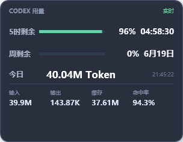

# Token Monitoring

**简体中文** | [English](README.English.md)

Token Monitoring 是一个暂时仅面向 Windows x64 的 Codex 用量悬浮面板。它用于快速查看 5 小时额度、周额度和本机当天的 Token 消耗，避免频繁打开 Codex 设置页面。

## 界面预览



悬浮面板集中显示剩余额度、重置时间、当天 Token 明细和缓存命中率。中文包与英文包使用相同布局。

## 主要功能

- 显示 5 小时剩余额度，并按秒更新重置倒计时。
- 显示周剩余额度及本地时间对应的重置日期。
- 显示当天总 Token、输入 Token、输出 Token、缓存读取 Token 和总体缓存命中率。
- 进度条彩色部分表示剩余额度，灰色部分表示已使用额度。
- 悬浮窗可自由拖动并记住位置。
- 默认仅在 Codex 为当前前台程序时显示，切换到其他软件后隐藏到系统托盘。
- 提供中文包和英文包，可选开机启动、手动刷新、显示已用/剩余比例。

界面倒计时每秒刷新；额度和 Token 数据默认每 30 秒重新读取一次。

## 系统要求

- Windows 10 22H2 或 Windows 11，64 位 x64。
- 已安装并登录 Codex 桌面应用或 Codex CLI。
- `codex.exe` 可从 `PATH`、正在运行的 Codex 进程、常见安装目录或 `CODEX_CLI_PATH` 找到。
- 发布包为自包含程序，不要求另装 Python、Node.js、Visual Studio 或 .NET。

当前不支持 32 位 Windows、macOS、Linux；ARM64 Windows 只能尝试通过 x64 兼容层运行，并非原生支持。项目于 2026 年 6 月 15 日使用 `codex-cli 0.139.0` 完成测试，后续 Codex 协议变更可能需要适配。

## 安装与使用

1. 下载并解压 `TokenMonitoring-win-x64-Chinese.zip`。
2. 将整个文件夹放在任意本地磁盘和任意目录，包括带空格或中文的路径。
3. 双击 `TokenMonitoring.exe`。
4. 右键系统托盘图标可调整显示方式、开机启动、重置位置、刷新或退出。

程序不依赖安装目录读取 Codex 数据。Token 日志固定从当前 Windows 用户的 `%USERPROFILE%\.codex\sessions` 和 `%USERPROFILE%\.codex\archived_sessions` 读取。设置写入 `%LOCALAPPDATA%\TokenMonitoring\settings.json`。

启用开机启动后，程序会在当前用户的 `HKCU\Software\Microsoft\Windows\CurrentVersion\Run` 中保存当前 EXE 路径；之后移动程序文件时需要重新启用开机启动。

## 数据来源与准确性

- 5 小时和周额度来自本机 Codex 的 `app-server`，使用 `account/rateLimits/read` 和 `account/rateLimits/updated` 协议消息。
- 当天 Token 按电脑本地日期统计本机 Codex JSONL 会话日志中的 `token_count` 事件。
- 5 小时或周额度重置不会清空当天 Token；只有本地日期跨过午夜才开始新的一天。
- 数据仅覆盖当前电脑上留存的 Codex 日志。已删除日志、其他电脑、ChatGPT 网页、普通 OpenAI API 或其他 GPT 客户端的用量不会计入。
- 缓存命中率按 `缓存读取 Token / 输入 Token` 计算。

## 隐私与联网

Token Monitoring 自身没有 `HttpClient`、Socket、WebRequest、遥测、更新检查或上传实现，也没有写入任何 API 地址、API Key 或访问令牌。程序不会读取 `%USERPROFILE%\.codex\auth.json`。

为了获取实时额度，程序会启动受信任的本机 `codex app-server --stdio`，通过标准输入输出交换 JSON 消息。Token Monitoring 进程不直接联网，但 Codex 子进程可能按照 Codex 自身的配置连接 OpenAI。若只读取本地 Token 日志，统计过程不会上传日志。

更完整的文件访问、联网边界、风险和审计结果见 [SECURITY.md](SECURITY.md)。

## 开发与打包

```powershell
dotnet build TokenMonitoring.slnx -c Release
dotnet run --project tests\TokenMonitoring.Tests\TokenMonitoring.Tests.csproj -c Release
dotnet run --project tests\TokenMonitoring.Tests\TokenMonitoring.Tests.csproj -c Release -- --integration
.\scripts\publish.ps1
```

发布结果位于 `artifacts\TokenMonitoring-win-x64-Chinese.zip` 和 `artifacts\TokenMonitoring-win-x64-English.zip`。

## 发布前注意

- 当前 EXE 未进行代码签名，其他电脑可能显示 Windows SmartScreen 警告。
- 当前应用图标来自用户提供的第三方图片，不自动包含在 MIT 许可证中。公开分发前必须确认图标授权，详情见 [THIRD_PARTY_NOTICES.md](THIRD_PARTY_NOTICES.md)。
